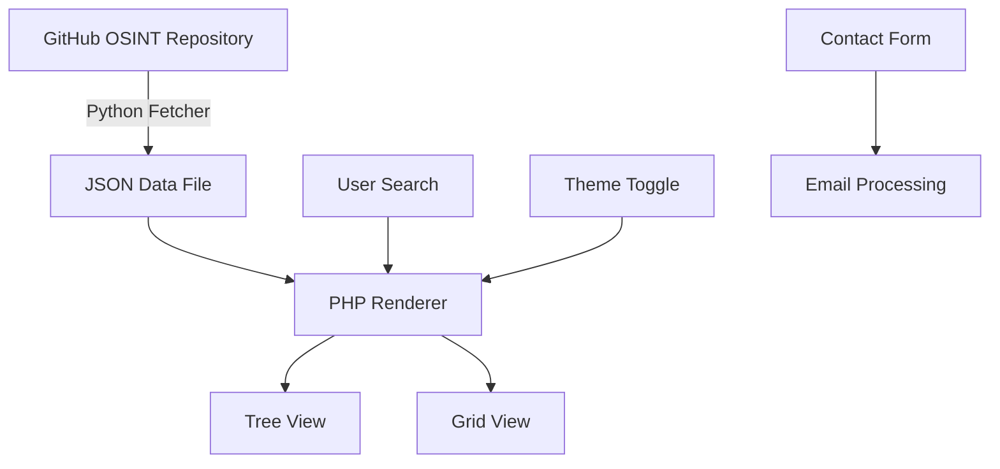

# OSINT Tool Explorer


**Interactive directory of Open Source Intelligence (OSINT) tools with dynamic visualization and smart search capabilities.**

[🔗 Live Demo](https://example.com/osint-tool-explorer)

## 📋 Overview

- 🌍 **Comprehensive database** of categorized OSINT tools extracted from curated repositories
- 🔍 **Dual-view interface** with hierarchical tree and grid layouts for intuitive navigation
- 🔄 **Light/dark mode** with keyboard shortcuts and accessibility features

## ✨ Features

### Core Features

🔍 **Smart Search** - Find tools by name, description, or category with real-time filtering

🌲 **Tree View** - Navigate hierarchical categories with expandable nodes, tool counts, and color coding

🧩 **Grid View** - Browse visual cards with tool descriptions, types, and direct access links

🌓 **Theme Switching** - Toggle between light and dark modes with persistent preferences

🔣 **Keyboard Navigation** - Full keyboard accessibility with documented shortcuts

### Technical Highlights

🛠️ **Dynamic Data Pipeline** - Automatically fetches and parses data from GitHub repositories

🚀 **No Database Required** - Uses JSON for data storage with PHP-based rendering

🔒 **Contact Form** - Secure messaging with CAPTCHA, rate limiting, and email validation

🧠 **JavaScript Tree Integration** - jsTree implementation with custom styling and event handling

## 🏗️ Architecture



## 🚀 Installation

### Prerequisites

- PHP 7.4 or higher
- Python 3.6+ (for data fetching)
- Web server (Apache/Nginx)

### Quick Start

```bash
# Clone the repository
git clone https://github.com/cyberpods/OSINT-Tool-Explorer.git
cd OSINT-Tool-Explorer

# Install Python dependencies
pip install -r requirements.txt

# Fetch OSINT data
python getdata.py

# Configure web server to point to the directory
```

### Advanced Setup

1. **Configure email settings:**
   Edit `send_contact.php` to update the recipient email address:

   ```php
   $to = "your-email@example.com"; // Change to your actual email
   ```

2. **Modify hCaptcha settings:**
   Update the site key in `contact.php` and secret key in `process_contact.php`:

   ```php
   // In contact.php
   <div class="h-captcha" data-sitekey="YOUR-SITE-KEY"></div>
   
   // In process_contact.php
   $secret = 'YOUR-SECRET-KEY';
   ```

3. **Customize data sources:**
   Edit `getdata.py` to fetch from additional repositories:

   ```python
   # Add more URL sources
   def fetch_readme():
       urls = [
           'https://raw.githubusercontent.com/jivoi/awesome-osint/master/README.md',
           # Add more repository URLs here
       ]
       # ...
   ```

## 💻 Usage


### Basic Navigation

- **Search Box**: Type to instantly filter tools
- **View Toggle**: Switch between tree and grid views
- **Theme Toggle**: Change between light and dark modes
- **Tool Cards**: Click to open the tool's website in a new tab

### Keyboard Shortcuts

| Key       | Action                   |
|-----------|--------------------------|
| `/`       | Focus search box         |
| `V`       | Toggle view (Tree/Grid)  |
| `D`       | Toggle dark mode         |
| `?`       | Show keyboard shortcuts  |
| `Home`    | Back to top              |
| `↑`/`↓`   | Navigate tree items      |
| `→`/`←`   | Expand/collapse nodes    |
| `Enter`   | Open selected tool       |

## 📁 Project Structure

```
OSINT-Tool-Explorer/
├── index.php              # Main application file
├── contact.php            # Contact form page
├── process_contact.php    # Contact form processing
├── send_contact.php       # Email sending functionality
├── getdata.py             # Python script to fetch OSINT data
├── awesome_osint.json     # Generated data file
└── requirements.txt       # Python dependencies
```

### Key Files

- **getdata.py**: Python script that fetches and parses OSINT tool data from GitHub repositories
- **index.php**: Main application file that renders the tree/grid views and handles user interactions
- **contact.php**: Contact form with styling and validation
- **send_contact.php**: Backend processing for contact submissions with rate limiting

## 🤝 Contributing

We welcome contributions to OSINT Tool Explorer! Please see our [CONTRIBUTING.md](CONTRIBUTING.md) file for details.

### Contribution Workflow

1. Fork the repository
2. Create a feature branch (`git checkout -b feature/amazing-feature`)
3. Commit your changes (`git commit -m 'Add some amazing feature'`)
4. Push to the branch (`git push origin feature/amazing-feature`)
5. Open a Pull Request

### Testing Requirements

- Test PHP changes with PHP 7.4+
- Verify dark mode functionality
- Ensure keyboard navigation works
- Check mobile responsiveness

## 📊 Data Sources

The OSINT Tool Explorer uses data from the following repositories:

- [jivoi/awesome-osint](https://github.com/jivoi/awesome-osint) - A curated list of OSINT resources

## 📜 License

This project is licensed under the MIT License - see the [LICENSE](LICENSE) file for details.

## ❓ FAQ

### How often is the tool data updated?
The data is fetched from GitHub repositories when you run the `getdata.py` script. You can set up a cron job to run this script periodically to keep the data updated.

### Can I add my own OSINT tools?
Yes! You can either contribute to the source repositories or modify the `awesome_osint.json` file directly with your tools.

### Does this work on mobile devices?
Yes, the interface is responsive and works on mobile devices. The grid view is especially optimized for smaller screens.

## 🙏 Credits

- [jsTree](https://www.jstree.com/) - jQuery tree plugin
- [Font Awesome](https://fontawesome.com/) - Icons
- [hCaptcha](https://www.hcaptcha.com/) - CAPTCHA protection
- jQuery for DOM manipulation
